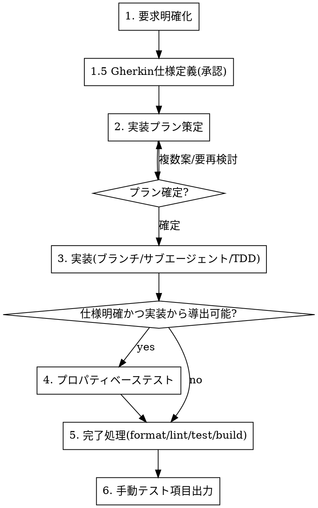

# アプリ開発フロー

このプロジェクトでのアプリ開発は、必ず以下のフェーズ順で進める。各フェーズには専用スキルがあり、メインエージェントが全体を管理しながらフェーズを進行させる。

**原則: 前のフェーズが完了し、必要なユーザー確認が取れるまで次のフェーズに進まない。**

## フロー全体

## 各フェーズと使用スキル

| フェーズ                      | 内容                                                                                                                                               | 使用スキル                                                                                  |
| ----------------------------- | -------------------------------------------------------------------------------------------------------------------------------------------------- | ------------------------------------------------------------------------------------------- |
| 1. 要求明確化                 | 要求の曖昧さ・不足を質問で潰し、合意した要求を確定する                                                                                             | `clarify-requirements`                                                                      |
| 1.5 Gherkin仕様定義           | 確定要求を Gherkin 記法（`docs/specs/<機能名>.feature`）で仕様化し、シナリオごとに `@unit` / `@integration` / `@manual` を付けてユーザー承認を得る | `gherkin-spec`                                                                              |
| 2. 実装プラン策定             | 確定要求を元にプランを設計。複数案があれば選択を確認。別セッションに引き継げるよう一時ドキュメント化                                               | `implementation-planning`                                                                   |
| 3. 実装                       | 作業ブランチを切り、実装はサブエージェントに委譲。メインはレビュー・全体管理。t-wada推奨TDDで進め、作業毎にコミット                                | `subagent-tdd-implementation`（内部で `tdd` / `storybook-dev` / `component-create` を利用） |
| 4. プロパティベーステスト     | 仕様が明確かつ対応コードから実装可能ならfast-checkで作成                                                                                           | `property-based-testing`                                                                    |
| 5. 完了処理                   | フォーマッタ適用・Lint・全テスト実行・ビルド確認                                                                                                   | `check-creation`                                                                            |
| 6. 手動テスト項目出力（必須） | `@manual` シナリオと自動チェックで検出できない手動QA観点を `integration-test.md` に出力する                                                        | `integration-test-viewpoints`                                                               |

## Gherkin仕様駆動ルール（必須）

- **機能追加・挙動変更・バグ修正では、必ずフェーズ1.5で Gherkin 仕様を定義し、ユーザー承認を得てから進む。**（挙動不変のリファクタ・docs・CI設定のみの変更は対象外）
- 承認済み `.feature` のシナリオから、**単体テスト（`@unit`）と結合テスト（`@integration`）を作成する**（フェーズ3）。テスト名はシナリオ名を日本語で用い、`.feature` への参照はテスト側に書かない。
- **自動化できないシナリオ（`@manual`）は手動テスト項目として必ず出力する**（フェーズ6）。
- 仕様が途中で変わったら、実装に進む前に `.feature` を更新して再承認を得る。

## 横断ルール（全フェーズ共通）

- **同様のミスの指摘が複数回発生したら、必ず `CLAUDE.md` に再発防止ルールを追記する。** → `record-recurring-mistakes`
- セキュリティに関わる変更（WebView/IPC/inject/capabilities/外部入力）では `security-review` を併用する。
- **各フェーズの手順は途中で打ち切らず、定義された順番通り最後まで実行する。** → `skill-order-discipline`

## このプロジェクト特有の留意点

- **desktop / mobile**: 同名コマンドでも `#[cfg(desktop)]` / `#[cfg(mobile)]` で実装が異なる。両方確認する。
- **inject スクリプト**: `src-tauri/src/inject/_src/` を変更したら `npm run build:inject`。ビルド済み `.js` は編集禁止。inject の開発手順は `inject-script-dev` スキルに従う。
- **serde 命名**: JS側 camelCase には `#[serde(rename)]` が必須。
- **Android**: `MainActivity.kt` のメソッド変更時は ProGuard keep ルールを同期（リリースビルドで動作確認）。

## メインエージェントの責務

- 各フェーズの完了判定とフェーズ間のゲート管理
- フェーズ1.5での Gherkin 仕様の承認取得と、シナリオ↔テスト/手動項目の漏れチェック
- フェーズ2でのプラン確定（複数案はユーザーに選択を確認）
- フェーズ3では**実装そのものをサブエージェントに委譲**し、自身はレビューと進行管理に徹する
- 横断ルールの監視（同じ指摘の再発をCLAUDE.mdに反映）

## 禁止事項

- 要求が曖昧なまま実装プランに進むこと
- Gherkin 仕様が未承認のまま（対象外の変更を除き）実装プランや実装に進むこと
- `@unit` / `@integration` シナリオにテストがない、または `@manual` シナリオが手動テスト項目に出力されていない状態で「完了」と報告すること
- プラン未確定のまま実装に着手すること
- 作業ブランチを切らずに（mainで）実装を進めること
- メインエージェントが自分で実装を書き進めてしまうこと（委譲が原則）
- TDDのRed-Green-Refactorを飛ばすこと
- 完了処理（format/lint/test/build）を省略して「完了」と報告すること
- フェーズ6（手動テスト項目出力）を省略すること
