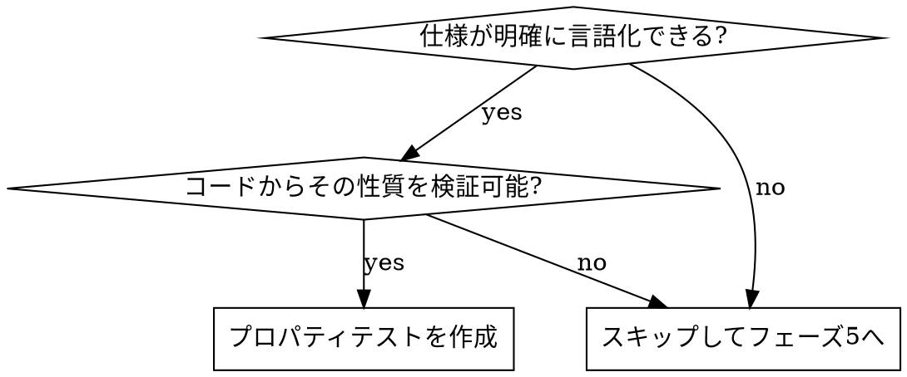

# プロパティベーステスト（フェーズ4）

実装完了後、対象が以下の**両方**を満たす場合に限り、対応する言語のライブラリでプロパティベーステストを作成する。

| 言語                               | ライブラリ                                     | 実行                                                   |
| ---------------------------------- | ---------------------------------------------- | ------------------------------------------------------ |
| TypeScript（フロント `src/`）      | `fast-check`                                   | `npm run test:property`                                |
| Rust（`src-tauri/`）               | `proptest`（dev-dependency）                   | `cargo test`（`--manifest-path src-tauri/Cargo.toml`） |
| Kotlin（`src-tauri/gen/android/`） | `kotest-property`（JUnit4 から `runBlocking`） | `:app:testUniversalDebugUnitTest`                      |

対象が以下の**両方**を満たすこと:

- 仕様が明確である（満たすべき性質を言語化できる）
- 対応コードの内容からその性質を実装・検証可能である

満たさない場合はこのフェーズをスキップし、フェーズ5へ進む（無理に作らない）。

## 適用判断



## 向いている対象（例）

- 入出力に不変条件・対称性がある純粋関数（例: 変換と逆変換の往復で元に戻る = ラウンドトリップ）
- 入力の範囲が広く、例示ベースでは網羅しづらいロジック（パース、正規化、座標計算）
- 冪等性・可換性・境界条件などの性質を持つ純粋関数
- 好適な対象の例:
  - TS: `src/lib/`（Tauri非依存の純粋関数）。例: `gridLayout.ts` の `calculateGridBounds`
  - Rust: `src-tauri/src/` の純粋関数。例: `commands/webview/column.rs` の `resolve_url`（URLエンコードのラウンドトリップ）
  - Kotlin: `src-tauri/gen/android/app/src/main/.../UrlUtils.kt` の `isLoginUrl` / `isInternalUrl`（部分文字列・プレフィックス不変条件）

## 配置・命名・実行・書き方（言語別）

### TypeScript（fast-check）

- 配置: 対象ソースと同じディレクトリ（コロケーション）
- 命名: `<name>.property.test.ts`（`test:property` が `property.test` を対象にするため必須）
- 実行: `npm run test:property`（`vitest run --project unit property.test` のエイリアス。通常の `npm test` でも実行される）
- 実装例: `src/lib/gridLayout.property.test.ts`

```typescript
import fc from "fast-check";
import { describe, expect, it } from "vitest";
import { calculateGridBounds } from "./gridLayout"; // 対象に置き換える

describe("対象 プロパティ", () => {
  it("満たすべき性質を1文で表現する", () => {
    fc.assert(
      fc.property(fc.array(fc.integer()), (input) => {
        expect(/* ... */).toBe(/* ... */);
      }),
    );
  });
});
```

### Rust（proptest）

- 配置: 対象モジュールの `#[cfg(test)]` 内（既存のテストモジュール配下に `mod properties` を作る）
- 依存: `src-tauri/Cargo.toml` の `[dev-dependencies]` に `proptest = "1"`
- 実行: `cargo test --manifest-path src-tauri/Cargo.toml <フィルタ>`
- 実装例: `src-tauri/src/commands/webview/column.rs` の `tests::properties`

```rust
mod properties {
    use super::*;
    use proptest::prelude::*;

    proptest! {
        #[test]
        fn 性質を表す名前(input in any::<String>()) {
            // 常に成り立つ不変条件を prop_assert! / prop_assert_eq! で検証
            prop_assert!(/* ... */);
        }
    }
}
```

### Kotlin（kotest-property）

- 配置: `src-tauri/gen/android/app/src/test/java/.../<Name>PropertyTest.kt`
- 依存: `app/build.gradle.kts` に `testImplementation("io.kotest:kotest-property:5.9.1")`（kotest 5.x は jvmTarget 1.8 互換。6.x は JVM 11 なので**上げない**）
- 既存テストは JUnit4 のため、kotest ランナーは使わず **JUnit4 の `@Test` から `runBlocking { forAll(...) }`** を呼ぶ
- 実行: `cd src-tauri/gen/android && ./gradlew.bat :app:testUniversalDebugUnitTest`（universal フレーバーのため `testDebugUnitTest` では実行されない。CLAUDE.md参照）
- 実装例: `UrlUtilsPropertyTest.kt`

```kotlin
import io.kotest.property.Arb
import io.kotest.property.arbitrary.string
import io.kotest.property.forAll
import kotlinx.coroutines.runBlocking
import org.junit.Test

class XxxPropertyTest {
  @Test
  fun `性質を表す名前`() = runBlocking {
    forAll(Arb.string()) { s -> /* Boolean を返す不変条件 */ true }
  }
}
```

## 共通の心得

- 性質（プロパティ）を1つずつ明確に表現する
- 失敗時に最小反例（shrink）が出るので、反例が出たら仕様と実装のどちらが正しいかを検討する

## 完了条件

- 対象の満たすべき性質がプロパティテストとして表現され、該当言語のテストコマンドが通る
- 適用対象がない場合は、その判断を明示してスキップする

完了したらフェーズ5（`check-creation`）へ進む。

## 禁止事項

- 仕様が曖昧なまま無理にプロパティテストをでっち上げること
- 実装をそのままなぞるだけ（性質を検証していない）のテストにすること
