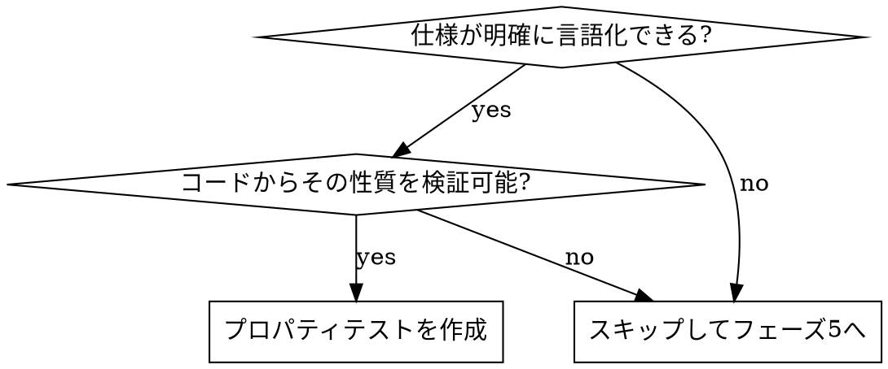

# プロパティベーステスト（フェーズ4）

実装完了後、対象が以下の**両方**を満たす場合に限り、`fast-check` でプロパティベーステストを作成する。

- 仕様が明確である（満たすべき性質を言語化できる）
- 対応コードの内容からその性質を実装・検証可能である

満たさない場合はこのフェーズをスキップし、フェーズ5へ進む（無理に作らない）。

## 適用判断



## 向いている対象（例）

- 入出力に不変条件・対称性がある純粋関数（例: 変換と逆変換の往復で元に戻る = ラウンドトリップ）
- 入力の範囲が広く、例示ベースでは網羅しづらいロジック（パース、正規化、座標計算）
- 冪等性・可換性・境界条件などの性質を持つ純粋関数
- このプロジェクトでは `src/lib/`（Tauri非依存の純粋関数）が好適。例: `gridLayout.ts` の `calculateGridBounds`

## 配置・命名・実行

- 配置: 対象ソースと同じディレクトリ（コロケーション）
- 命名: `<name>.property.test.ts`（`test:property` が `property.test` を対象にするため必須）
- 実行:
  ```bash
  npm run test:property
  ```
  （`vitest run --project unit property.test` のエイリアス。通常の `npm test` でも一緒に実行される）

## 書き方

実装例は `src/lib/gridLayout.property.test.ts` を参照。

```typescript
import fc from "fast-check";
import { describe, expect, it } from "vitest";
import { calculateGridBounds } from "./gridLayout"; // 対象に置き換える

describe("対象 プロパティ", () => {
  it("満たすべき性質を1文で表現する", () => {
    fc.assert(
      fc.property(fc.array(fc.integer()), (input) => {
        // input に対して常に成り立つ不変条件を検証する
        expect(/* ... */).toBe(/* ... */);
      }),
    );
  });
});
```

- 性質（プロパティ）を1つずつ明確に表現する
- 失敗時に最小反例が出るので、反例が出たら仕様と実装のどちらが正しいかを検討する

## 完了条件

- 対象の満たすべき性質がプロパティテストとして表現され、`npm run test:property` が通る
- 適用対象がない場合は、その判断を明示してスキップする

完了したらフェーズ5（`check-creation`）へ進む。

## 禁止事項

- 仕様が曖昧なまま無理にプロパティテストをでっち上げること
- 実装をそのままなぞるだけ（性質を検証していない）のテストにすること
