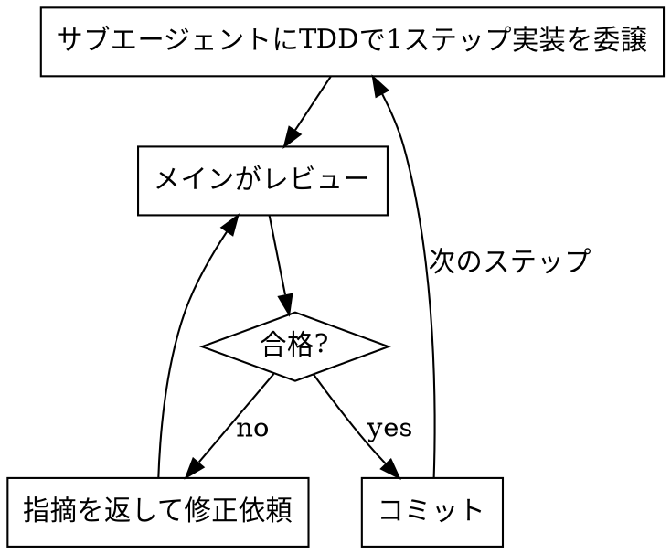

# サブエージェント委譲によるTDD実装（フェーズ3）

確定したプランを、作業ブランチ上で**サブエージェントに委譲**しながらTDDで実装する。メインエージェントは実装を自分で書かず、レビューと全体管理に徹する。

## 開始前

1. **作業ブランチを作成する**（mainで直接実装しない）。CLAUDE.mdの「新規ブランチを作成するべきかまず確認すること」に従い、必要性をユーザーに確認してから切る。
   ```bash
   git switch -c feat/<対象名>
   ```
2. プランの作業分割（フェーズ2が出力した作業フォルダ `tmp/plans/<日付>-<対象名>/plan.md`）をタスク一覧として把握する。
3. **進捗ファイルを用意する**。計画と同じフォルダに `progress.md` を作成し、以降の実装で進捗を逐次更新する（**計画と進捗は必ず同一フォルダに配置する**）。
   - パス: `tmp/plans/<日付>-<対象名>/progress.md`
   - 記載項目: 全作業ステップの一覧と各ステータス（未着手／実装中／レビュー中／コミット済み）、コミットハッシュ、委譲時に指定したモデル、特記事項
   - 各ステップの状態が変わるたびに更新する（着手時・レビュー結果・コミット後）。

## 実装サイクル（作業ステップごとに繰り返す）



### 1. 委譲

`Agent` ツールで実装ステップをサブエージェント（`general-purpose`）に委譲する。

**モデル選択（必須）**: 委譲するサブエージェントには、**メインエージェントより必ず下位のモデルを指定する**（`Agent` ツールの `model` 引数）。モデルの上下関係は `opus` > `sonnet` > `haiku`。

- メインが `opus` → サブエージェントは `sonnet` または `haiku`
- メインが `sonnet` → サブエージェントは `haiku`
- メインと同格・上位のモデルは指定しない。

**実行前の出力（必須）**: `Agent` を呼ぶ**前に**、メインのモデルと、そのステップで指定するサブエージェントのモデルを必ずテキストで出力する（例: 「メイン=opus / サブエージェント=sonnet で委譲します」）。出力してからツールを呼ぶこと。指定したモデルは `progress.md` にも記録する。

委譲プロンプトには必ず以下を含める:

- 対象ステップの要求と完了基準
- **t-wada推奨TDD（Red-Green-Refactor）で進めること** → `tdd` スキル準拠
- 作成するテストの種類（下記「テストの作成」）
- プロジェクト規約: コロケーション配置、import順（`import-x/order`、`@/` は internal）、新規コードは `@/` エイリアス、テストケース名は日本語、`var` 禁止
- 該当する場合の制約: desktop/mobile の `#[cfg]` 分岐、serde の `#[serde(rename)]`、inject の `npm run build:inject`、Android の ProGuard keep ルール同期（CLAUDE.md参照）

### 2. レビュー（メインの責務）

サブエージェントの成果を必ずレビューする:

- テストが**先に**書かれ、Red→Greenを経ているか
- テストが振る舞いを正しく表現しているか（実装に追従しただけでないか）
- 要求・完了基準を満たすか、規約違反がないか
- 不足・誤りがあれば具体的な指摘を返して再依頼する

### 3. コミット（作業毎）

レビュー合格したら、その作業ステップ単位でコミットする。

```bash
git add -A && git commit -m "<このステップの内容>"
```

コミット後、`progress.md` の該当ステップを「コミット済み」に更新し、コミットハッシュを記録する。

## テストの作成（プロジェクト標準）

実装対象に応じて以下を作る。配置は対象ソースと同じディレクトリ（コロケーション）。

| テスト種別             | ツール                  | 配置                                                        | 目的                                           |
| ---------------------- | ----------------------- | ----------------------------------------------------------- | ---------------------------------------------- |
| 単体テスト             | vitest                  | `src/**/<name>.test.ts(x)`                                  | 関数・hook・ロジック・コンポーネントの単体検証 |
| コンポーネントカタログ | Storybook Story         | `src/components/<Name>/<Name>.stories.tsx`                  | 見た目のバリエーション（Light/Dark等）         |
| インタラクションテスト | Storybook play function | 同上のStory内 `play`（`npm run test:story` でchromium実行） | コンポーネントのインタラクション検証           |
| プロパティテスト       | fast-check + vitest     | `src/**/<name>.property.test.ts`                            | 仕様が明確な純粋関数の不変条件検証             |

- Story/play function の書き方・テーマバリエーションは `storybook-dev` スキルに従う。
- 新規コンポーネントの雛形は `component-create` スキルを使う。
- 純粋ロジック（例: `src/lib/`）は vitest 単体テストを基本とし、不変条件があれば `property-based-testing`（フェーズ4）でプロパティテストを足す。

## 完了条件

- プランの全作業ステップが実装・レビュー済みで、各ステップがコミットされている
- 必要なテスト（単体／カタログ／play function／プロパティ）が揃っている
- `progress.md` が全ステップ「コミット済み」になっており、計画（`plan.md`）と同一フォルダに残っている

完了したらフェーズ4（`property-based-testing`）の要否を判断する。

## 禁止事項

- mainブランチで直接実装すること
- メインエージェントが委譲せず自分で実装を書き進めること
- サブエージェントにメインと同格・上位のモデルを指定すること（必ず下位モデルを使う）
- モデルを出力せずに `Agent` を呼ぶこと
- 計画と進捗を別フォルダに分けて配置すること
- テストより先に実装を書くこと（TDD違反）
- レビューを省略してコミットすること
- 複数ステップをまとめて1コミットにすること（作業毎にコミットする）
