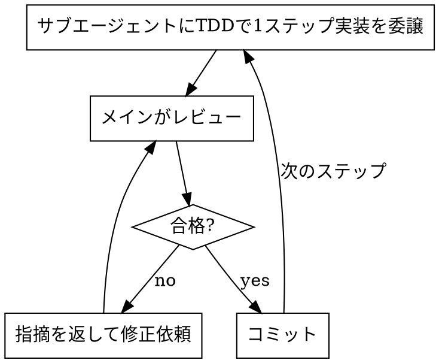

# サブエージェント委譲によるTDD実装（フェーズ3）

確定したプランを、作業ブランチ上で**サブエージェントに委譲**しながらTDDで実装する。メインエージェントは実装を自分で書かず、レビューと全体管理に徹する。

## 開始前

1. **作業ブランチを作成する**（develop / main で直接実装しない）。CLAUDE.mdの「新規ブランチを作成するべきかまず確認すること」に従い、必要性をユーザーに確認してから、最新化した develop から切る。
   ```bash
   git switch develop && git pull origin develop
   git switch -c feat/<対象名>   # バグ修正は fix/<対象名>
   ```
2. プランの作業分割（フェーズ2が出力した作業フォルダ `tmp/plans/<日付>-<対象名>/plan.md`）をタスク一覧として把握する。
3. **進捗ファイルを用意する**。計画と同じフォルダに `progress.md` を作成し、以降の実装で進捗を逐次更新する（**計画と進捗は必ず同一フォルダに配置する**）。
   - パス: `tmp/plans/<日付>-<対象名>/progress.md`
   - 記載項目: 全作業ステップの一覧と各ステータス（未着手／実装中／レビュー中／コミット済み）、コミットハッシュ、委譲時に指定したモデル、特記事項
   - 各ステップの状態が変わるたびに更新する（着手時・レビュー結果・コミット後）。

## 実装サイクル（作業ステップごとに繰り返す）


```dot
digraph cycle {
  rankdir=TB;
  "サブエージェントにTDDで1ステップ実装を委譲" [shape=box];
  "メインがレビュー" [shape=box];
  "合格?" [shape=diamond];
  "指摘を返して修正依頼" [shape=box];
  "コミット" [shape=box];

  "サブエージェントにTDDで1ステップ実装を委譲" -> "メインがレビュー";
  "メインがレビュー" -> "合格?";
  "合格?" -> "指摘を返して修正依頼" [label="no"];
  "指摘を返して修正依頼" -> "メインがレビュー";
  "合格?" -> "コミット" [label="yes"];
  "コミット" -> "サブエージェントにTDDで1ステップ実装を委譲" [label="次のステップ"];
}
```

### 1. 委譲

`Agent` ツールで実装ステップをサブエージェント（`general-purpose`）に委譲する。

**モデル選択（必須）**: 委譲するサブエージェントには **`model: "sonnet"` を指定する**（CLAUDE.md「サブエージェント運用」）。Sonnet では対応が難しい作業が出た場合は、**ユーザーの承認を得てから**メインが対応する（承認なしにメインが巻き取らない）。

**実行前の出力（必須）**: `Agent` を呼ぶ**前に**、「メイン=<モデル名> / サブエージェント=sonnet」を必ずテキストで出力する（例: 「メイン=opus / サブエージェント=sonnet で委譲します」）。出力してからツールを呼ぶこと。指定したモデルは `progress.md` にも記録する。

委譲プロンプトには必ず以下を含める:

- 対象ステップの要求と完了基準
- **t-wada推奨TDD（Red-Green-Refactor）で進めること** → `tdd` スキル準拠。**テストを1件追加 → 実行してRedを確認 → 最小実装でGreen、を1件ずつ繰り返すこと。テストと実装を同時に書かないこと**を明記する
- **実装は「いま Red のテスト1件だけ」を通す最小限に留めること**（例: 許可側テストの段階では常に Ok を返し、拒否側のテストでそれを Red にしてから分岐を足す）。追加時点で Green になったテストがあれば、実装先書きの証拠として報告させる
- **各テストのRed時の失敗出力（抜粋）を報告に含めること**を必須として明記する
- **例外（Gherkin由来のテストを実装後に作成する場合）**: プランで「実装後作成」を選んだステップでは、上の2項目に代えて「シナリオを満たす実装を先に書き、その後にシナリオごとのテストを作成してよい。Red確認・Red時の失敗出力は求めない。テストはシナリオのGiven/When/Thenから書き、実装を見て期待値を決めない。『Red』と称する報告はしない」と明記する。メインが事後にミューテーションで検証する
- 担当する承認済みGherkinシナリオ（`docs/specs/*.feature` から該当シナリオの全文を貼る。`@unit` / `@integration` のテストを作らせ、テスト名はシナリオ名に対応させる。`@manual` は作らせない。`.feature` への参照はテスト・コメント・コミットに書かせない）
- 作成するテストの種類（下記「テストの作成」）
- プロジェクト規約: コロケーション配置、import順（`import-x/order`、`@/` は internal）、新規コードは `@/` エイリアス、テストケース名は日本語、`var` 禁止
- 該当する場合の制約: desktop/mobile の `#[cfg]` 分岐、serde の `#[serde(rename)]`、inject の `npm run build:inject`、Android の ProGuard keep ルール同期（CLAUDE.md参照）
- **コミット末尾のトレーラー（`Co-Authored-By` / `Claude-Session`）はメインが委譲プロンプトに明記し、サブエージェントはそれをそのまま使う**こと（サブエージェント側のセッションリマインダーの表記が異なっていても上書きしない、`--amend` での書き換えもしない）
- **プランに記載の無い判断（トレーラーの表記など）で迷っても作業を止めずに進め、報告に「要確認」として記載する**こと

### 2. レビュー（メインの責務）

サブエージェントの成果を必ずレビューする:

- TDD で進めたステップ: テストが**先に**書かれ、Red→Greenを経ているか。**報告されたRed時の失敗出力を確認**し、テストと実装を同時に書く TDD 違反が無いか検証する（Gherkin由来で「実装後作成」を選んだステップは、この項目の代わりにミューテーションで検証する）
- 担当した `@unit` / `@integration` シナリオすべてにテストがあり、テスト名がシナリオ名に対応しているか（`.feature` への参照が混入していないか）
- テストが振る舞いを正しく表現しているか（実装に追従しただけでないか）
- 要求・完了基準を満たすか、規約違反がないか
- 報告に記載された「要確認」事項を確認し、次回以降の委譲プランに反映する
- 不足・誤りがあれば具体的な指摘を返して再依頼する
- **コミット前に、主要な条件分岐を一時的に壊して（ミューテーション）テストがRedになることを確認する**

### 3. コミット（作業毎）

レビュー合格したら、その作業ステップ単位でコミットする。

```bash
git add -A && git commit -m "<このステップの内容>"
```

コミット後、`progress.md` の該当ステップを「コミット済み」に更新し、コミットハッシュを記録する。

## テストの作成（プロジェクト標準）

実装対象に応じて以下を作る。配置は対象ソースと同じディレクトリ（コロケーション）。

| テスト種別             | ツール                  | 配置                                                        | 目的                                           |
| ---------------------- | ----------------------- | ----------------------------------------------------------- | ---------------------------------------------- |
| 単体テスト             | vitest                  | `src/**/<name>.test.ts(x)`                                  | 関数・hook・ロジック・コンポーネントの単体検証 |
| コンポーネントカタログ | Storybook Story         | `src/components/<Name>/<Name>.stories.tsx`                  | 見た目のバリエーション（Light/Dark等）         |
| インタラクションテスト | Storybook play function | 同上のStory内 `play`（`npm run test:story` でchromium実行） | コンポーネントのインタラクション検証           |
| プロパティテスト       | fast-check + vitest     | `src/**/<name>.property.test.ts`                            | 仕様が明確な純粋関数の不変条件検証             |

- Story/play function の書き方・テーマバリエーションは `storybook-dev` スキルに従う。
- 新規コンポーネントの雛形は `component-create` スキルを使う。
- 純粋ロジック（例: `src/lib/`）は vitest 単体テストを基本とし、不変条件があれば `property-based-testing`（フェーズ4）でプロパティテストを足す。

## 完了条件

- プランの全作業ステップが実装・レビュー済みで、各ステップがコミットされている
- 必要なテスト（単体／カタログ／play function／プロパティ）が揃っている
- 承認済みGherkinの `@unit` / `@integration` シナリオすべてにテストが存在する（漏れをメインがシナリオ一覧と突き合わせて確認）
- `progress.md` が全ステップ「コミット済み」になっており、計画（`plan.md`）と同一フォルダに残っている

完了したらフェーズ4（`property-based-testing`）の要否を判断する。

## 禁止事項

- develop / main ブランチで直接実装すること
- メインエージェントが委譲せず自分で実装を書き進めること（Sonnet で困難な作業をユーザー承認のうえ巻き取る場合を除く）
- サブエージェントに `sonnet` 以外のモデルを指定すること
- モデルを出力せずに `Agent` を呼ぶこと
- 計画と進捗を別フォルダに分けて配置すること
- テストより先に実装を書くこと（TDD違反。ただしGherkin由来のテストをプランで「実装後作成」と定めたステップを除く）
- レビューを省略してコミットすること
- 複数ステップをまとめて1コミットにすること（作業毎にコミットする）
