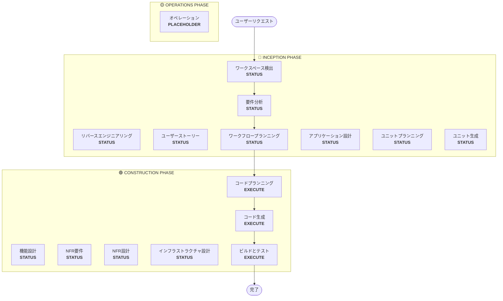

# ワークフロープランニング

**目的**：実行するフェーズを決定し、包括的な実行計画を作成する

**常に実行**：このフェーズは要件とスコープを理解した後に常に実行される

## ステップ1：すべての事前コンテキストの読み込み

### 1.1 リバースエンジニアリング成果物の読み込み（ブラウンフィールドの場合）

- architecture.md
- component-inventory.md
- technology-stack.md
- dependencies.md

### 1.2 要件分析の読み込み

- requirements.md（意図分析を含む）
- requirement-verification-questions.md（回答付き）

### 1.3 ユーザーストーリーの読み込み（実行済みの場合）

- stories.md
- personas.md

## ステップ2：詳細なスコープと影響の分析

**完全なコンテキスト（要件＋ストーリー）を取得したので、詳細な分析を実施する：**

### 2.1 変換スコープの検出（ブラウンフィールドのみ）

**ブラウンフィールドプロジェクトの場合**、変換スコープを分析する：

#### アーキテクチャの変換

- **単一コンポーネントの変更** vs **アーキテクチャの変換**
- **インフラストラクチャの変更** vs **アプリケーションの変更**
- **デプロイメントモデルの変更**（Lambda→コンテナ、EC2→サーバーレスなど）

#### 関連コンポーネントの特定

変換のために以下を特定する：

- 更新が必要な**インフラストラクチャコード**
- 変更が必要な**CDKスタック**
- **API Gateway**の設定
- **ロードバランサー**の要件
- 必要な**ネットワーキング**の変更
- **モニタリング/ロギング**の適応

#### クロスパッケージへの影響

- 更新が必要な**CDKインフラストラクチャ**パッケージ
- バージョン更新が必要な**共有モデル**
- エンドポイント変更が必要な**クライアントライブラリ**
- 新しいテストシナリオが必要な**テストパッケージ**

### 2.2 変更影響の評価

#### 影響領域

1. **ユーザー向けの変更**：ユーザーエクスペリエンスに影響するか？
2. **構造的な変更**：システムアーキテクチャを変更するか？
3. **データモデルの変更**：データベーススキーマまたはデータ構造に影響するか？
4. **APIの変更**：インターフェースまたはコントラクトに影響するか？
5. **NFRへの影響**：パフォーマンス、セキュリティ、またはスケーラビリティに影響するか？

#### アプリケーション層への影響（該当する場合）

- **コードの変更**：新しいエントリポイント、アダプター、設定
- **依存関係**：新しいライブラリ、フレームワークの変更
- **設定**：環境変数、設定ファイル
- **テスト**：ユニットテスト、統合テスト

#### インフラストラクチャ層への影響（該当する場合）

- **デプロイメントモデル**：Lambda→ECS、EC2→Fargateなど
- **ネットワーキング**：VPC、セキュリティグループ、ロードバランサー
- **ストレージ**：永続ボリューム、共有ストレージ
- **スケーリング**：オートスケーリングポリシー、キャパシティプランニング

#### オペレーション層への影響（該当する場合）

- **モニタリング**：CloudWatch、カスタムメトリクス、ダッシュボード
- **ロギング**：ログ集約、構造化ロギング
- **アラート**：アラーム設定、通知チャネル
- **デプロイメント**：CI/CDパイプラインの変更、ロールバック戦略

### 2.3 コンポーネント関係のマッピング（ブラウンフィールドのみ）

**ブラウンフィールドプロジェクトの場合**、コンポーネント依存関係グラフを作成する：

```markdown
## コンポーネント関係
- **主要コンポーネント**：[変更されるパッケージ]
- **インフラストラクチャコンポーネント**：[CDK/Terraformパッケージ]
- **共有コンポーネント**：[モデル、ユーティリティ、クライアント]
- **依存コンポーネント**：[このコンポーネントを呼び出すサービス]
- **サポートコンポーネント**：[モニタリング、ロギング、デプロイメント]
```

各関連コンポーネントについて：

- **変更タイプ**：メジャー、マイナー、設定のみ
- **変更の理由**：直接の依存関係、デプロイメントモデル、ネットワーキング
- **変更の優先度**：クリティカル、重要、オプション

### 2.4 リスク評価

リスクレベルを評価する：

1. **低**：孤立した変更、簡単なロールバック、よく理解されている
2. **中**：複数のコンポーネント、適度なロールバック、いくつかの未知数
3. **高**：システム全体への影響、複雑なロールバック、重大な未知数
4. **クリティカル**：本番環境に重要、困難なロールバック、高い不確実性

## ステップ3：フェーズの決定

### 3.1 ユーザーストーリー - 実行済みかスキップか？

**実行済み**：次の判断に進む
**未実行 - 以下の場合に実行**：

- 複数のユーザーペルソナ
- ユーザーエクスペリエンスへの影響
- 受け入れ基準が必要
- チームコラボレーションが必要

**以下の場合はスキップ**：

- 内部リファクタリング
- 明確な再現手順を持つバグ修正
- 技術的負債の削減
- インフラストラクチャの変更

### 3.2 アプリケーション設計 - 以下の場合に実行

- 新しいコンポーネントまたはサービスが必要
- コンポーネントメソッドとビジネスルールの定義が必要
- サービス層の設計が必要
- コンポーネントの依存関係の明確化が必要

**以下の場合はスキップ**：

- 既存のコンポーネント境界内での変更
- 新しいコンポーネントやメソッドがない
- 純粋な実装の変更

### 3.3 設計（ユニットプランニング/生成） - 以下の場合に実行

- 新しいデータモデルまたはスキーマ
- APIの変更または新しいエンドポイント
- 複雑なアルゴリズムまたはビジネスロジック
- 状態管理の変更
- 複数のパッケージに変更が必要
- Infrastructure-as-Codeの更新が必要

**以下の場合はスキップ**：

- 単純なロジックの変更
- UIのみの変更
- 設定の更新
- 直接的な実装

### 3.4 NFR実装 - 以下の場合に実行

- パフォーマンス要件
- セキュリティの考慮事項
- スケーラビリティの懸念
- モニタリング/オブザーバビリティが必要

**以下の場合はスキップ**：

- 既存のNFR設定で十分
- 新しいNFR要件がない
- NFRへの影響がない単純な変更

## ステップ4：適応型詳細の注記

**適応型深度の説明については[depth-levels.md](../common/depth-levels.md)を参照してください**

実行される各ステージについて：

- 定義されたすべての成果物が作成される
- 成果物内の詳細レベルは問題の複雑さに適応する
- モデルは問題の特性に基づいて適切な詳細を決定する

## ステップ5：マルチモジュールの調整分析（ブラウンフィールドのみ）

**複数のモジュール/パッケージを持つブラウンフィールドの場合**、依存関係を分析して最適な更新戦略を決定する：

### 5.1 モジュール依存関係の分析

- ビルドシステムの依存関係と依存関係マニフェストを調べる
- ビルド時依存関係とランタイム依存関係を特定する
- モジュール間のAPIコントラクトと共有インターフェースをマップする

### 5.2 更新戦略の決定

依存関係分析に基づいて以下を決定する：

- **更新シーケンス**：依存関係のために最初に更新する必要があるモジュール
- **並列化の機会**：同時に更新できるモジュール
- **調整要件**：バージョン互換性、APIコントラクト、デプロイメント順序
- **テスト戦略**：モジュールごとのテスト vs 統合テストのアプローチ
- **ロールバック戦略**：シーケンスの途中で失敗が発生した場合の回復計画

### 5.3 調整計画の文書化

```markdown
## モジュール更新戦略
- **更新アプローチ**：[シーケンシャル/並列/ハイブリッド]
- **クリティカルパス**：[他の更新をブロックするモジュール]
- **調整ポイント**：[共有API、インフラストラクチャ、データコントラクト]
- **テストチェックポイント**：[統合を検証するタイミング]
```

影響を受ける各モジュールについて特定する：

- **更新の優先度**：最初に更新する必要があるもの vs 後で更新できるもの
- **依存関係の制約**：何に依存しているか、何が依存しているか
- **変更スコープ**：メジャー（破壊的）、マイナー（互換）、パッチ（修正）

## ステップ6：ワークフローの可視化を生成する

以下を示すMermaidフローチャートを作成する：

- シーケンス内のすべてのフェーズ
- 各条件付きフェーズのEXECUTEまたはSKIPの判断
- 各フェーズの状態に適切なスタイリング

**スタイリングルール**（フローチャートの後に追加する）：

```
style WD fill:#4CAF50,stroke:#1B5E20,stroke-width:3px,color:#fff
style CP fill:#4CAF50,stroke:#1B5E20,stroke-width:3px,color:#fff
style CG fill:#4CAF50,stroke:#1B5E20,stroke-width:3px,color:#fff
style BT fill:#4CAF50,stroke:#1B5E20,stroke-width:3px,color:#fff
style US fill:#BDBDBD,stroke:#424242,stroke-width:2px,stroke-dasharray: 5 5,color:#000
style Start fill:#CE93D8,stroke:#6A1B9A,stroke-width:3px,color:#000
style End fill:#CE93D8,stroke:#6A1B9A,stroke-width:3px,color:#000

linkStyle default stroke:#333,stroke-width:2px
```

**スタイルガイドライン**：

- 完了/常に実行：`fill:#4CAF50,stroke:#1B5E20,stroke-width:3px,color:#fff`（マテリアルグリーン、白テキスト）
- 条件付きEXECUTE：`fill:#FFA726,stroke:#E65100,stroke-width:3px,stroke-dasharray: 5 5,color:#000`（マテリアルオレンジ、黒テキスト）
- 条件付きSKIP：`fill:#BDBDBD,stroke:#424242,stroke-width:2px,stroke-dasharray: 5 5,color:#000`（マテリアルグレー、黒テキスト）
- 開始/終了：`fill:#CE93D8,stroke:#6A1B9A,stroke-width:3px,color:#000`（マテリアルパープル、黒テキスト）
- フェーズコンテナ：明るいマテリアルカラーを使用する（INCEPTION：#BBDEFB、CONSTRUCTION：#C8E6C9、OPERATIONS：#FFF59D）

## ステップ7：実行計画ドキュメントの作成

`aidlc-docs/inception/plans/execution-plan.md`を作成する：

```markdown
# 実行計画

## 詳細分析サマリー

### 変換スコープ（ブラウンフィールドのみ）
- **変換タイプ**：[単一コンポーネント/アーキテクチャ/インフラストラクチャ]
- **主要な変更**：[説明]
- **関連コンポーネント**：[リスト]

### 変更影響の評価
- **ユーザー向けの変更**：[はい/いいえ - 説明]
- **構造的な変更**：[はい/いいえ - 説明]
- **データモデルの変更**：[はい/いいえ - 説明]
- **APIの変更**：[はい/いいえ - 説明]
- **NFRへの影響**：[はい/いいえ - 説明]

### コンポーネント関係（ブラウンフィールドのみ）
[コンポーネント依存関係グラフ]

### リスク評価
- **リスクレベル**：[低/中/高/クリティカル]
- **ロールバックの複雑さ**：[簡単/適度/困難]
- **テストの複雑さ**：[シンプル/適度/複雑]

## ワークフローの可視化



**注**：STATUSプレースホルダーを実際のフェーズステータス（COMPLETED/SKIP/EXECUTE）に置き換え、適切なスタイリングを適用する

## 実行するフェーズ

### 🔵 INCEPTION PHASE

- [x] ワークスペース検出（完了）
- [x] リバースエンジニアリング（完了/スキップ）
- [x] 要件の詳細化（完了）
- [x] ユーザーストーリー（完了/スキップ）
- [x] 実行計画（進行中）
- [ ] アプリケーション設計 - [EXECUTE/SKIP]
  - **理由**：[実行またはスキップする理由]
- [ ] ユニットプランニング - [EXECUTE/SKIP]
  - **理由**：[実行またはスキップする理由]
- [ ] ユニット生成 - [EXECUTE/SKIP]
  - **理由**：[実行またはスキップする理由]

### 🟢 CONSTRUCTION PHASE

- [ ] 機能設計 - [EXECUTE/SKIP]
  - **理由**：[実行またはスキップする理由]
- [ ] NFR要件 - [EXECUTE/SKIP]
  - **理由**：[実行またはスキップする理由]
- [ ] NFR設計 - [EXECUTE/SKIP]
  - **理由**：[実行またはスキップする理由]
- [ ] インフラストラクチャ設計 - [EXECUTE/SKIP]
  - **理由**：[実行またはスキップする理由]
- [ ] コードプランニング - EXECUTE（常時）
  - **理由**：実装アプローチが必要
- [ ] コード生成 - EXECUTE（常時）
  - **理由**：コード実装が必要
- [ ] ビルドとテスト - EXECUTE（常時）
  - **理由**：ビルド、テスト、検証が必要

### 🟡 OPERATIONS PHASE

- [ ] オペレーション - PLACEHOLDER
  - **理由**：将来のデプロイメントとモニタリングワークフロー

## パッケージ変更シーケンス（ブラウンフィールドのみ）

[該当する場合、依存関係を含むパッケージ更新シーケンスをリスト]

## 推定タイムライン

- **総フェーズ数**：[数]
- **推定期間**：[時間見積もり]

## 成功基準

- **主要目標**：[主な目的]
- **主要成果物**：[リスト]
- **品質ゲート**：[リスト]

[ブラウンフィールドの場合]

- **統合テスト**：すべてのコンポーネントが連携して動作すること
- **オペレーション準備**：モニタリング、ロギング、アラートが動作すること

```

## ステップ8：状態トラッキングの初期化

`aidlc-docs/aidlc-state.md`を更新する：

```markdown
# AI-DLC 状態トラッキング

## プロジェクト情報
- **プロジェクトタイプ**：[グリーンフィールド/ブラウンフィールド]
- **開始日**：[ISOタイムスタンプ]
- **現在のステージ**：INCEPTION - ワークフロープランニング

## 実行計画サマリー
- **総ステージ数**：[数]
- **実行するステージ**：[リスト]
- **スキップするステージ**：[理由付きリスト]

## ステージ進捗

### 🔵 INCEPTION PHASE
- [x] ワークスペース検出
- [x] リバースエンジニアリング（該当する場合）
- [x] 要件分析
- [x] ユーザーストーリー（該当する場合）
- [x] ワークフロープランニング
- [ ] アプリケーション設計 - [EXECUTE/SKIP]
- [ ] ユニットプランニング - [EXECUTE/SKIP]
- [ ] ユニット生成 - [EXECUTE/SKIP]

### 🟢 CONSTRUCTION PHASE
- [ ] 機能設計 - [EXECUTE/SKIP]
- [ ] NFR要件 - [EXECUTE/SKIP]
- [ ] NFR設計 - [EXECUTE/SKIP]
- [ ] インフラストラクチャ設計 - [EXECUTE/SKIP]
- [ ] コードプランニング - EXECUTE
- [ ] コード生成 - EXECUTE
- [ ] ビルドとテスト - EXECUTE

### 🟡 OPERATIONS PHASE
- [ ] オペレーション - PLACEHOLDER

## 現在のステータス
- **ライフサイクルフェーズ**：INCEPTION
- **現在のステージ**：ワークフロープランニング完了
- **次のステージ**：[実行する次のステージ]
- **ステータス**：進行準備完了
```

## ステップ9：計画のユーザーへの提示

```markdown
# 📋 ワークフロープランニング完了

以下に基づいた包括的な実行計画を作成しました：
- あなたのリクエスト：[サマリー]
- 既存システム：[ブラウンフィールドの場合はサマリー]
- 要件：[実行済みの場合はサマリー]
- ユーザーストーリー：[実行済みの場合はサマリー]

**詳細分析**：
- リスクレベル：[レベル]
- 影響：[主要な影響のサマリー]
- 影響を受けるコンポーネント：[リスト]

**推奨実行計画**：

[X]ステージの実行を推奨します：

🔵 **INCEPTION PHASE：**
1. [ステージ名] - *理由：* [実行する理由]
2. [ステージ名] - *理由：* [実行する理由]
...

🟢 **CONSTRUCTION PHASE：**
3. [ステージ名] - *理由：* [実行する理由]
4. [ステージ名] - *理由：* [実行する理由]
...

[Y]ステージのスキップを推奨します：

🔵 **INCEPTION PHASE：**
1. [ステージ名] - *理由：* [スキップする理由]
2. [ステージ名] - *理由：* [スキップする理由]
...

🟢 **CONSTRUCTION PHASE：**
3. [ステージ名] - *理由：* [スキップする理由]
4. [ステージ名] - *理由：* [スキップする理由]
...

[複数のパッケージを持つブラウンフィールドの場合]
**推奨パッケージ更新シーケンス**：
1. [パッケージ] - [理由]
2. [パッケージ] - [理由]
...

**推定タイムライン**：[期間]

> **📋 <u>**レビュー必須：**</u>**
> 実行計画を確認してください：`aidlc-docs/inception/plans/execution-plan.md`

> **🚀 <u>**次は何をしますか？**</u>**
>
> **選択してください：**
>
> 🔧 **変更のリクエスト** - 必要に応じて実行計画の修正をリクエストする
> [スキップされるステージがある場合：]
> 📝 **スキップされたステージを追加する** - 現在SKIPとしてマークされているステージを含める
> ✅ **承認して続ける** - 計画を承認して**[次のステージ名]**に進む
```

## ステップ10：ユーザーの応答への対応

- **承認された場合**：実行計画の次のステージに進む
- **変更がリクエストされた場合**：実行計画を更新して再確認する
- **ユーザーがステージを強制的に含める/除外する場合**：それに応じて計画を更新する

## ステップ11：インタラクションのログ記録

`aidlc-docs/audit.md`にログ記録する：

```markdown
## ワークフロープランニング - 承認
**タイムスタンプ**：[ISOタイムスタンプ]
**AIプロンプト**：「この計画で続行する準備はできていますか？」
**ユーザー応答**：「[ユーザーの完全なraw応答]」
**ステータス**：[承認済み/変更リクエスト]
**コンテキスト**：[X]ステージを実行するワークフロー計画が作成された

---
```
