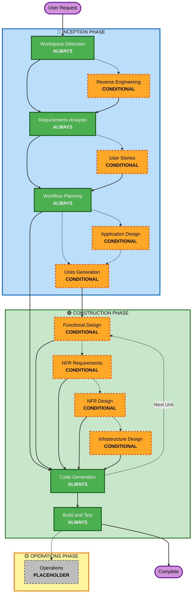

# AI-DLC アダプティブワークフロー概要

**目的**：完全なワークフロー構造を理解するためのAIモデルと開発者向けの技術リファレンス。

**注**：core-workflow.md（ユーザーウェルカムメッセージ）とREADME.md（ドキュメント）にも同様のコンテンツが存在します。この重複は意図的なものです。各ファイルは異なる目的を持っています：

- **このファイル**：AIモデルのコンテキスト読み込み用のMermaid図表を含む詳細な技術リファレンス
- **core-workflow.md**：ASCII図表を含むユーザー向けウェルカムメッセージ
- **README.md**：リポジトリ向けの人間が読めるドキュメント

## 3フェーズライフサイクル

• **INCEPTION PHASE**：計画とアーキテクチャ（ワークスペース検出 + 条件付きフェーズ + ワークフロープランニング）
• **CONSTRUCTION PHASE**：設計、実装、ビルドとテスト（ユニットごとの設計 + コードプランニング/生成 + ビルド＆テスト）
• **OPERATIONS PHASE**：将来のデプロイとモニタリングワークフローのプレースホルダー

## アダプティブワークフロー

• **ワークスペース検出**（常時）→ **リバースエンジニアリング**（ブラウンフィールドのみ）→ **要件分析**（常時、適応深度）→ **条件付きフェーズ**（必要に応じて）→ **ワークフロープランニング**（常時）→ **コード生成**（常時、ユニットごと）→ **ビルドとテスト**（常時）

## 動作の仕組み

• **AIが分析する**：リクエスト、ワークスペース、複雑さを分析して必要なステージを決定
• **常に実行するステージ**：ワークスペース検出、要件分析（適応深度）、ワークフロープランニング、コード生成（ユニットごと）、ビルドとテスト
• **他のステージはすべて条件付き**：リバースエンジニアリング、ユーザーストーリー、アプリケーション設計、ユニット生成、ユニットごとの設計ステージ（機能設計、NFR要件、NFR設計、インフラストラクチャ設計）
• **固定シーケンスなし**：ステージは特定のタスクに最も適した順序で実行される

## チームの役割

• **専用の質問ファイルで回答する**：[Answer]:タグと文字選択（A、B、C、D、E）を使用
• **オプションEを利用可能**：提供されたオプションが合わない場合は「その他」を選択して、カスタム回答を記述
• **チームとして作業**し、各フェーズをレビューして進める前に承認する
• **アーキテクチャアプローチを集合的に決定**する（必要な場合）
• **重要**：これはチームの取り組みです。各フェーズに関連するステークホルダーを巻き込んでください

## AI-DLC 3フェーズワークフロー

**ステージの説明：**

**🔵 INCEPTION PHASE** - 計画とアーキテクチャ

- ワークスペース検出：ワークスペースの状態とプロジェクトタイプを分析（ALWAYS）
- リバースエンジニアリング：既存のコードベースを分析（CONDITIONAL - ブラウンフィールドのみ）
- 要件分析：要件を収集・検証（ALWAYS - 適応深度）
- ユーザーストーリー：ユーザーストーリーとペルソナを作成（CONDITIONAL）
- ワークフロープランニング：実行計画を作成（ALWAYS）
- アプリケーション設計：高レベルのコンポーネント識別とサービスレイヤー設計（CONDITIONAL）
- ユニット生成：作業単位に分解（CONDITIONAL）

**🟢 CONSTRUCTION PHASE** - 設計、実装、ビルドとテスト

- 機能設計：ユニットごとの詳細なビジネスロジック設計（CONDITIONAL、ユニットごと）
- NFR要件：NFRを決定してテクスタックを選択（CONDITIONAL、ユニットごと）
- NFR設計：NFRパターンと論理コンポーネントを組み込む（CONDITIONAL、ユニットごと）
- インフラストラクチャ設計：実際のインフラストラクチャサービスにマップ（CONDITIONAL、ユニットごと）
- コード生成：パート1（プランニング）とパート2（生成）でコードを生成（ALWAYS、ユニットごと）
- ビルドとテスト：すべてのユニットをビルドして包括的なテストを実行（ALWAYS）

**🟡 OPERATIONS PHASE** - プレースホルダー

- オペレーション：将来のデプロイとモニタリングワークフローのプレースホルダー（PLACEHOLDER）

**主要原則：**

- フェーズは価値をもたらす場合のみ実行される
- 各フェーズは独立して評価される
- INCEPTIONは「何を」と「なぜ」に焦点を当てる
- CONSTRUCTIONは「どのように」プラス「ビルドとテスト」に焦点を当てる
- OPERATIONSは将来の拡張のためのプレースホルダー
- シンプルな変更では条件付きINCEPTIONステージをスキップする場合がある
- 複雑な変更では完全なINCEPTIONとCONSTRUCTIONの処理を受ける
