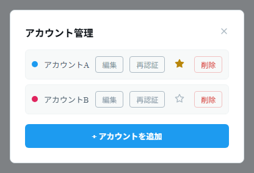

# アカウントを追加する

1. ツールバーの **アカウント**（人型アイコン）ボタン（`Ctrl+Shift+A`）を押して **アカウント管理** を開きます。
2. **「＋ アカウントを追加」** を押すと、X のログイン用ウィンドウが開きます。
3. 通常どおり X にログインします。ログインの完了が検出されると、自動的にアカウントが追加されます。
4. 複数のアカウントを登録したい場合は、2〜3 を繰り返します。

_アカウントごとの「編集」「再認証」「削除」ボタンと、デフォルト指定の ★ が並びます。_

## アカウント管理でできること

- **色** — アカウントごとに色が割り当てられ、カラムヘッダーやタブの色で見分けられます。「編集」ボタンから、アカウント名と色を変更できます。
- **デフォルトアカウント（★）** — ★ ボタンを押すと、ツイート作成時に最初に使われるアカウントに設定できます。
- **再認証** — 「再認証」ボタンでログインし直し、Cookie が無効になった場合などにセッションを更新できます。
- **削除** — 「削除」ボタンでアカウントを削除します。そのアカウントのログイン情報（データ）も削除されます。

> 各アカウントは独立したセッションを保持するため、同じ端末で複数アカウントに同時ログインしたまま利用できます。
