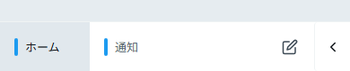
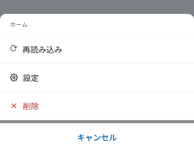
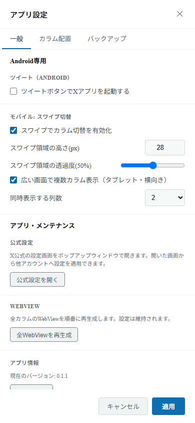
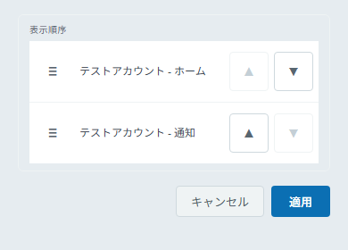

# Android での使い方

## 画面構成

画面下部の **タブバー** で操作します。

- 各 **タブ** が 1 つのカラムです。タップでそのカラムに切り替わります。
- タブにはアカウントの色が付き、アクティブなカラムでは自動更新のカウントダウンが表示されます。
- **✏️**（ツイート作成）ボタンが常に表示されます。
- **« / »** ボタンでメニューを開閉すると、次の操作ボタンが現れます。
  - 🔗 URL をポップアップで開く
  - ⚙️ アプリ設定
  - 👤 アカウント管理
  - ＋ カラム追加
  - API レート制限の表示（アプリ設定の「API残量モニター」が有効な場合）

_各タブが 1 つのカラムです。右端のボタンでメニューを開閉します。_

## タブの長押しメニュー

タブを **長押し**（または右クリック相当の操作）すると、アクションメニューが開きます。

- **設定** — そのカラムの個別設定を開きます。
- **削除** — そのカラムを削除します。
- **再読み込み** — そのカラムを再読み込みします。

_タブを長押しすると、再読み込み・設定・削除を選べるメニューが開きます。_

## Android 専用の設定

アプリ設定 →「一般」には、Android でのみ **「Android専用」** グループが表示されます（ツイートボタンの動作、スワイプ切替、広い画面での複数カラム表示）。デスクトップ向けの「ポップアップウィンドウ」の項目は表示されません。

_「Android専用」グループでスワイプ切替や複数カラム表示を設定します。_

「バックアップ」タブでは、設定の書き出しと復元ができます（[バックアップと復元](./settings#バックアップと復元-応用)）。Android ではファイルの保存先・読み込み元を端末のファイル選択画面で指定します。

## スワイプでカラム切替

タブバー付近のスワイプ領域を左右にスワイプすると、隣のカラムへ切り替えられます。
有効／無効・領域の高さ・透過度は、アプリ設定 →「一般」→ **「モバイル: スワイプ切替」** で調整できます。

カラムの並び順は、アプリ設定の「カラム配置」タブで変更できます。

_Android のカラム配置タブでは、「表示順序」の ▲ / ▼ でカラムの順序を入れ替えます。_

## 複数カラム同時表示（タブレット・横向き）

アプリ設定 →「一般」→ **「Android専用」** グループの **「広い画面で複数カラム表示」** を有効にすると、幅の広い画面（横向き・タブレットなど）でカラムを複数並べて表示できます（対応端末のみ）。
有効にすると表示する **列数**（2〜6、既定は 2）を選べます。

- 画面幅が約 600dp 未満のときは、設定にかかわらず 1 列で表示されます。
- 1 列あたり約 300dp を確保できない列数は選べても入りきらないため、入る最大の列数に自動で減ります。
- 表示中のカラム（アクティブ）から連続して並べます。末尾付近では、最後のカラムが右端に収まるよう左へずらして表示します。
- 設定した列数より登録カラム数が少ないときは、登録数ぶんだけ表示します。

## ツイート作成

アプリ設定の **「ツイート（Android）」** で「ツイートボタンで X アプリを起動する」を有効にすると、✏️ ボタンで端末の X アプリを開いて投稿できます（無効時はアプリ内の作成画面を使います）。
