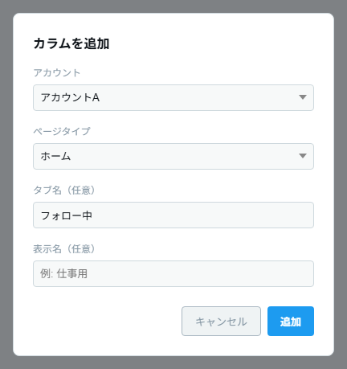
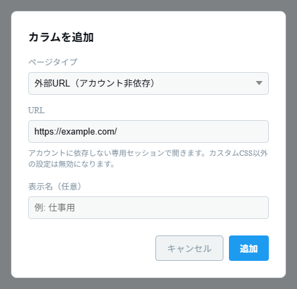
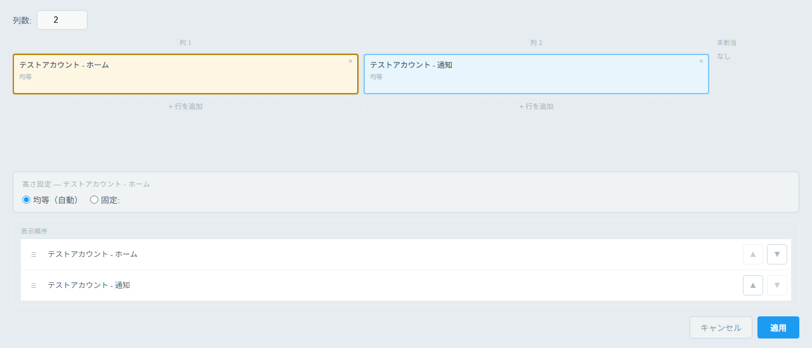
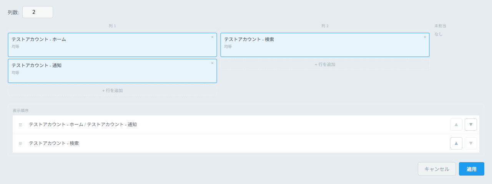
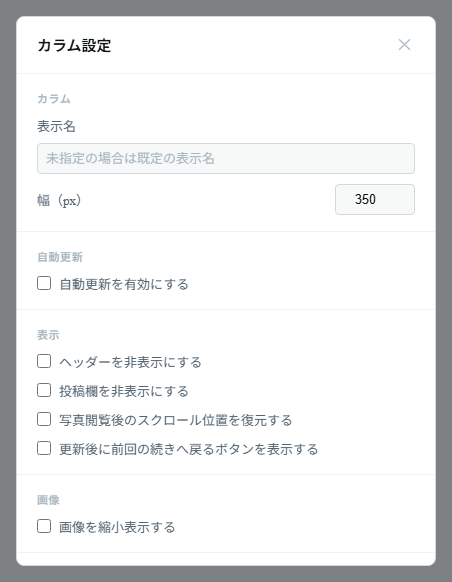

# カラムの使い方

## カラムを使う

### カラムを追加する

1. ツールバーの **カラム追加**（＋アイコン）ボタン（`Ctrl+N`）を押します。
2. **アカウント** を選びます（ページタイプが「外部 URL」の場合、アカウント選択欄は表示されません）。
3. **ページタイプ** を選びます。

   | ページタイプ                 | 表示内容                                     | 追加入力                       |
   | ---------------------------- | -------------------------------------------- | ------------------------------ |
   | ホーム                       | ホームタイムライン                           | タブ名（任意。例: フォロー中） |
   | 通知                         | 通知                                         | —                              |
   | 検索                         | 検索結果                                     | 検索クエリ（例: `tauri`）      |
   | リスト                       | リスト                                       | リスト ID（例: `1234567890`）  |
   | カスタム URL                 | 任意の X ページ                              | URL（例: `https://x.com/...`） |
   | 外部 URL（アカウント非依存） | 任意の URL（X 以外も可）。専用の保存先を持つ | URL                            |
   | 投稿                         | 投稿フォームのみを表示する投稿専用カラム     | —                              |

4. 必要に応じて **表示名（任意）** を入力します（例: 仕事用）。未入力の場合は「アカウント名 + ページ種別」が表示名になります。
5. **「追加」** を押すとカラムが作成されます。

_アカウント・ページタイプ・タブ名などを選んで「追加」を押します（画像はホームの例）。_

_ページタイプで「外部 URL（アカウント非依存）」を選ぶと、アカウント欄の代わりに URL 欄が表示されます。_

### カラムの操作（デスクトップ）

カラムヘッダーのボタンで操作します。

- **先頭までスクロール**（上向きの山形アイコン） — カラムを先頭までスクロールします。
- **↺ 更新** — 手動でカラムを更新します。
- **⟳ ページを再読み込み** — カラムのページを再読み込みします。
- **設定（歯車）** — そのカラムの個別設定を開きます（[カラム個別設定](#カラム個別設定)）。
- **閉じる（✕）** — カラムを削除します。

カラムの並べ替えや配置の変更は、アプリ設定の **「カラム配置」** タブで行います（[グリッドレイアウト](#グリッドレイアウト-応用)）。

### 自動更新

各カラムは既定で自動更新が有効です。間隔やカウントダウン表示はカラム設定、または全体設定の「カラムデフォルト」で変更できます。スクロール操作中は更新がスキップされ、閲覧の邪魔になりません。

## グリッドレイアウト（応用）

カラムは縦横のマス目（グリッド）に配置できます。デスクトップでは
**アプリ設定（`Ctrl+,`）→「カラム配置」タブ** で編集します。

### 基本概念

- カラムは **列（縦のグループ）** に割り当てます。
- 同じ列に複数のカラムを置くと **縦積み** になります。
- 列の数や、各列の中の行数を自由に増やせます。

### 配置の手順

1. 「カラム配置」タブを開きます。
2. **「列数」** を設定します。
3. グリッドの空きセル（`+`）をクリックすると、そのセルが配置先として選択されます。
4. 右側の **「未割当」** リストから配置したいカラムをクリックすると、選択中のセルに配置されます。
5. 列の下の **「＋ 行を追加」** で、その列に縦積みのセルを増やせます。
6. 配置済みセルの **×** ボタンで、そのカラムを未割当に戻せます。

### 高さの設定

配置済みのカラム（セル）をクリックすると、画面下部に **高さ設定** が表示されます。

- **均等（自動）** — 列内の他のカラムと高さを均等に分けます。
- **固定** — 高さを数値で指定します。単位は **px** または **%** を選べます。

### 表示順序

「表示順序」リストの **▲ / ▼** ボタンで、列（グループ）単位の並び順を入れ替えられます。

最後に **「適用」** を押すと配置が反映されます。

_列ごとにカラムを割り当て、選択したカラムの高さ設定や「表示順序」を編集します。_

_同じ列にカラムを複数置くと縦積みになり、「表示順序」では列単位でまとまって表示されます。_

## カラム個別設定

カラムヘッダーの **設定（歯車）** ボタン（Android はタブ長押し → 設定）から、そのカラムだけの設定を変更できます。

| セクション                     | 設定項目                                                                                                                                                                                             |
| ------------------------------ | ---------------------------------------------------------------------------------------------------------------------------------------------------------------------------------------------------- |
| カラム                         | 表示名（未指定なら既定の表示名）、幅（px・デスクトップのみ。200〜1200）                                                                                                                              |
| 自動更新                       | 自動更新の有効／無効、更新間隔（10〜3600 秒）、カウントダウン表示                                                                                                                                    |
| 表示                           | ヘッダーの非表示、投稿欄の非表示、カスタムメニューボタンの表示、写真閲覧後のスクロール位置復元（「画像を縮小表示」がオンのときのみ設定可）、（ホームカラムのみ）更新後に前回の続きへ戻るボタンを表示 |
| 画像                           | 画像を縮小表示（幅を `50%` や `200px` で指定）                                                                                                                                                       |
| 画像ブラー                     | 画像をぼかして表示（ぼかし量を `10px` などで指定）。右クリック（PC）／長押し（モバイル）で一時的に解除                                                                                               |
| 通知                           | 新着をデスクトップ通知するかどうか                                                                                                                                                                   |
| NG ワード                      | 1 行 1 ワードで入力。該当する投稿を非表示にします（`/正規表現/flags` 形式も指定可）                                                                                                                  |
| リポストを非表示にするユーザー | 1 行 1 ユーザー ID（@以降）で入力。指定ユーザーがリポストした投稿を非表示にします                                                                                                                    |
| ホワイトリスト                 | 指定ワードを含む投稿のみを表示します（NG ワードとは逆の効果）                                                                                                                                        |
| カスタム CSS                   | そのカラムに適用する CSS を自由に記述                                                                                                                                                                |

- 下部の **「再読み込み」** でカラムをすぐ再読み込みできます。
- 変更は **「適用」** を押すと反映されます。

_表示名・幅・自動更新・表示などのセクションごとに、そのカラムだけの設定を変更できます。_
