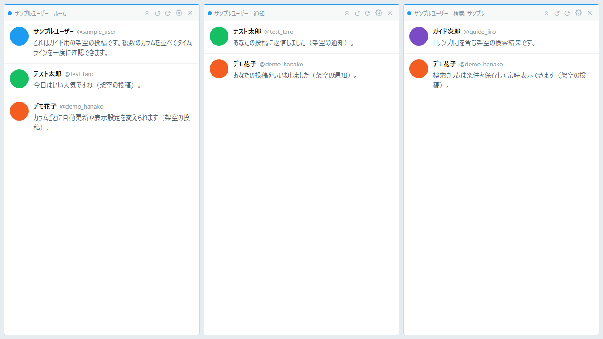

# Multi Column X 利用ガイド

Multi Column X（マルチカラム X）は、TweetDeck スタイルで Twitter/X を閲覧できるアプリです。
複数のアカウントと複数のカラム（タイムライン）を同時に並べて表示できます。
Windows / Linux のデスクトップと Android に対応しています。

> このガイドは「アプリを使う人」向けです。ソースコードのビルドや開発については [README.md](https://github.com/natsuyasai/multi-column-x/blob/main/README.md) を参照してください。

## はじめての5ステップ（クイックスタート）

初めて使うときは、次の順で進めると 5 分ほどで使い始められます。

1. **インストールする** — [Releases](https://github.com/natsuyasai/multi-column-x/releases) から OS に合ったファイルをダウンロードして実行します。Windows で SmartScreen の警告が出た場合は「詳細情報」→「実行」で続行できます。→ [インストール](./install)
2. **アカウントを追加する** — ツールバーの「アカウント」ボタン（`Ctrl+Shift+A`）→「＋ アカウントを追加」を押し、開いたウィンドウで X にログインします。→ [アカウントを追加する](./accounts)
3. **カラムを追加する** — ツールバーの「カラム追加」ボタン（`Ctrl+N`）で、アカウントとページタイプ（ホーム・通知・検索など）を選んで「追加」を押します。→ [カラムを使う](./columns#カラムを使う)
4. **自動更新と設定を確認する** — 各カラムは既定で自動更新されます。カラムヘッダーの歯車ボタンで更新間隔や表示を、アプリ設定（`Ctrl+,`）で全体の設定を変えられます。→ [カラム個別設定](./columns#カラム個別設定)、[アプリ全体設定](./settings#アプリ全体設定)
5. **ツイートを作成する／ショートカットを確認する** — `Ctrl+T` でツイート作成ウィンドウを開けます。カラム上で `?` キーを押すとショートカット一覧を表示できます。→ [ポップアップ機能](./popup-shortcuts#ポップアップ機能)、[キーボードショートカット](./popup-shortcuts#キーボードショートカット-応用)

## Multi Column X とは

_ホーム・通知・検索など、複数のカラムを横に並べて同時に表示できます。_

主な特徴は次のとおりです。

- **マルチアカウント** — 複数の X アカウントを登録し、アカウントごとに独立したログイン状態（Cookie）で利用できます。
- **マルチカラム** — ホーム・通知・検索・リスト・任意の URL を、好きな数だけ並べて同時に表示できます。
- **グリッドレイアウト** — カラムを縦横のマス目状に配置し、列の中で縦積みもできます。
- **自動更新** — 各カラムを一定間隔で自動リロードします（スクロール中は更新をスキップ）。
- **カラムごとの細かい設定** — 自動更新間隔・ヘッダー非表示・NG ワード／ホワイトリスト・リポスト非表示・画像の縮小やぼかし・カスタム CSS などを個別に設定できます。
- **ポップアップ表示** — 画像・動画やリンクを別ウィンドウで開けます。
- **拡張機能（Windows のみ）** — Chrome の拡張機能を読み込み、すべてのアカウントのカラムで使えます。→ [拡張機能](./settings#拡張機能-応用)
- **バックアップと復元** — アカウント情報・カラム構成・設定をファイルに書き出し、あとから復元できます。→ [バックアップと復元](./settings#バックアップと復元-応用)
- **自動更新（アプリ本体）** — 新しいバージョンが出ると、アプリ内で更新できます。
