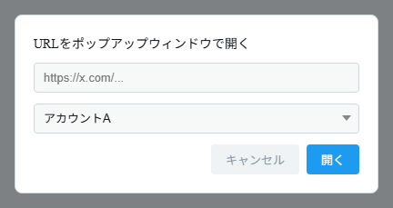
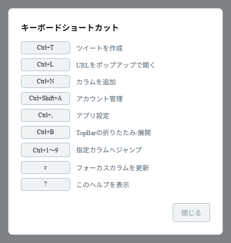

# ポップアップとショートカット

## ポップアップ機能

別ウィンドウでコンテンツを開く機能です。

- **メディアポップアップ** — タイムライン上の画像・動画を別ウィンドウで開きます。
- **動画の長押し／右クリックメニュー** — カラム上の動画を長押し（PC は右クリック）すると、ポップアップ表示や動画のダウンロード（Android のみ）を選べるメニューが開きます。
- **リンクポップアップ** — ツールバーの **URL を開く**（リンクアイコン）ボタン（`Ctrl+L`）から、任意の URL を専用ウィンドウで開きます。
- **ツイート作成ウィンドウ** — ツールバーの **ツイート**（鉛筆アイコン）ボタン（`Ctrl+T`）から、ツイート作成画面を別ウィンドウで開きます。
- **ポップアップ内のアカウント切替** — ポップアップ上部のツールバーから、表示中のアカウントをその場で切り替えられます。

ポップアップは Esc キーで閉じられます（アプリ設定の「ポップアップウィンドウ」で切り替え可能）。

_URL を入力し、使うアカウントを選んで「開く」を押すと専用ウィンドウで開きます。_

## キーボードショートカット（応用）

> ショートカットはデスクトップ版で利用できます。特に記載のないものは **Ctrl** キーと組み合わせます。

| ショートカット       | 機能                         |
| -------------------- | ---------------------------- |
| `Ctrl+T`             | ツイート作成ウィンドウを開く |
| `Ctrl+L`             | URL をポップアップで開く     |
| `Ctrl+N`             | カラムを追加する             |
| `Ctrl+Shift+A`       | アカウント管理を開く         |
| `Ctrl+,`             | アプリ全体設定を開く         |
| `Ctrl+B`             | ツールバーの折りたたみ／展開 |
| `Ctrl+1` 〜 `Ctrl+9` | 1〜9 番目のカラムへ移動      |
| `r`                  | フォーカス中のカラムを更新   |
| `?`                  | ショートカット一覧を表示     |

`r` と `?` は Ctrl なしで操作します（文字入力中は無効です）。

_`?` キーで表示されるショートカット一覧です。「閉じる」で閉じます。_
