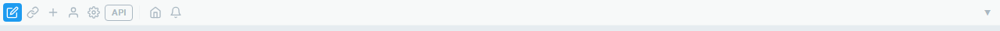
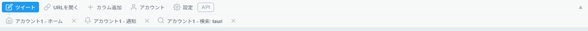
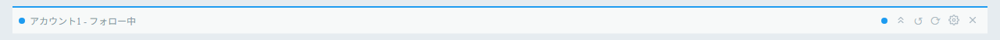

# 初回起動と画面構成

起動直後はアカウントもカラムもありません。まず [アカウントを追加](./accounts) し、続いて [カラムを追加](./columns#カラムを使う) します。

## デスクトップ（Windows / Linux）

画面上部に **ツールバー（TopBar）** があります。左から次のボタンが並びます（各ボタンはアイコンで表示されます）。

| ボタン（アイコン）   | 機能                            | ショートカット |
| -------------------- | ------------------------------- | -------------- |
| ツイート（鉛筆）     | ツイート作成ウィンドウを開く    | `Ctrl+T`       |
| URL を開く（リンク） | 任意の URL をポップアップで開く | `Ctrl+L`       |
| カラム追加（＋）     | カラムを追加する                | `Ctrl+N`       |
| アカウント（人型）   | アカウント管理を開く            | `Ctrl+Shift+A` |
| 設定（歯車）         | アプリ全体設定を開く            | `Ctrl+,`       |
| API                  | API レート制限を表示する        | —              |

- **API** ボタンは、X 内部 API のレート制限状況をポップオーバーで表示します。アプリ設定「一般」の「API残量モニター」で表示の有効／無効を切り替えられます（既定は有効）。
- 右端の **▼ / ▲** ボタンでツールバーの折りたたみ／展開を切り替えます（`Ctrl+B`）。
- 折りたたみ時はアイコンのみ、展開時はラベル付きで表示されます。

_折りたたみ時はアイコンのみが並び、右側にカラムのアイコン一覧が表示されます。_

_展開するとラベル付きのボタンになり、下の行に登録済みカラムの一覧が表示されます。_

- ツールバーには登録済みカラムの一覧も並び、クリックすると該当カラムへスクロールします。
- ツールバーの各列（カラムボタンの並びの領域）を 8px 以上ドラッグすると、列単位でカラムを並び替えられます。ドラッグせずにクリックすると従来どおりジャンプ／閉じる操作になります（キーボードでの並び替えには対応していません。アプリ設定の「カラム配置」タブからは並び替えできます）。
- 同じ列に複数行あるカラムはツールバー上で 1 つの要素にまとまり、列ごと移動します。
- 並び順は再起動後も保持され、カラムの実際の配置にも反映されます。

ツールバーの下に、追加したカラムが横並び（およびグリッド配置）で表示されます。

## Android

画面下部に **タブバー** があります。各タブが 1 つのカラムに対応し、タップで切り替えます。詳しくは [Android での使い方](./android) を参照してください。

## カラムヘッダーの見方（デスクトップ）

各カラムの上部にはヘッダーがあり、次の情報・操作が表示されます。

- 左端の色のドット／上辺の色 … そのカラムが使っているアカウントの色
- カラム名（アカウント名 + ページ種別、または設定したラベル）
- 未読バッジ … 未読がある場合に表示される丸印。クリックでクリア
- カウントダウン（`◯◯s`）… 次の自動更新までの秒数
- **先頭までスクロール**（上向きの山形アイコン）／**↺**（更新）／**⟳**（ページを再読み込み）／**設定**（歯車）／**閉じる**（✕）ボタン

_色のドット・カラム名・未読バッジ・各操作ボタンが 1 行に並びます。_
