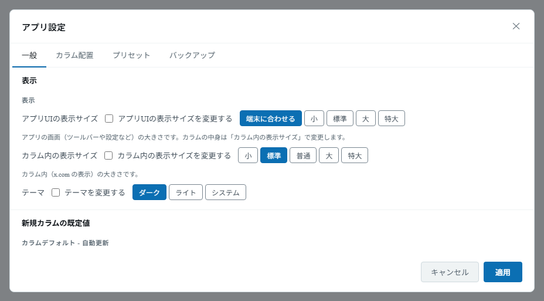
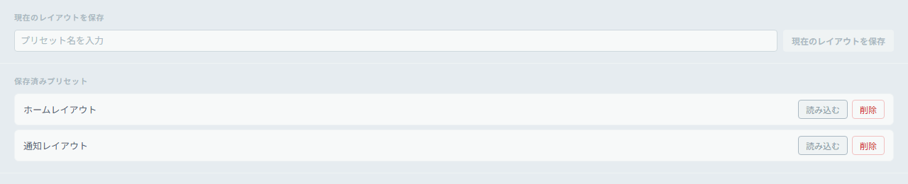
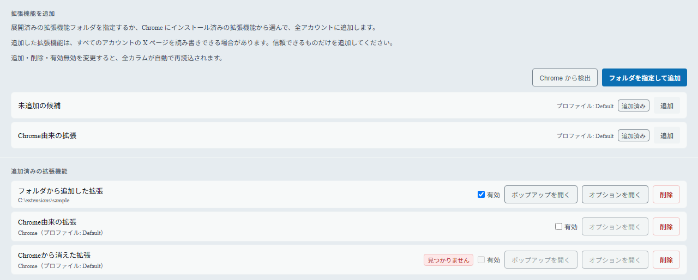
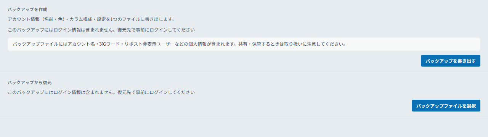
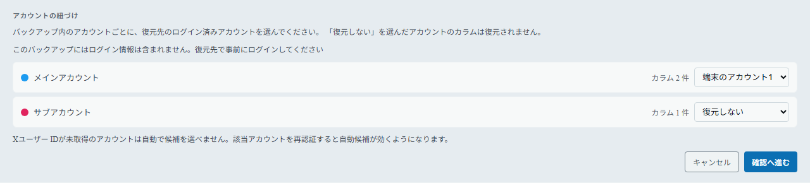

# 設定

## アプリ全体設定

ツールバーの **設定**（歯車アイコン）ボタン（`Ctrl+,`）でアプリ全体の設定を開きます。次のタブがあります。

| タブ         | 内容                                                                            | 対象環境         |
| ------------ | ------------------------------------------------------------------------------- | ---------------- |
| 一般         | 表示・新規カラムの既定値・フィルタ・メディアなどの全体設定                      | 全環境           |
| カラム配置   | カラムの配置・並び順（[グリッドレイアウト](./columns#グリッドレイアウト-応用)） | 全環境           |
| プリセット   | レイアウトの保存と呼び出し                                                      | デスクトップのみ |
| 拡張機能     | Chrome 拡張機能の追加と管理                                                     | Windows のみ     |
| バックアップ | 設定・カラム構成の書き出しと復元                                                | 全環境           |

### 「一般」タブの主な項目

_「一般」タブではアプリUIの表示サイズ・カラム内の表示サイズ・テーマ・カラムデフォルトなどをまとめて設定できます。_

「一般」タブの項目は、次のグループに分かれています。

#### 表示

- **アプリUIの表示サイズ** — ツールバーや設定画面などアプリ自体の大きさです。既定は「端末に合わせる」（Android は端末のフォントサイズ設定に追従）で、「小／標準／大／特大」から固定することもできます（「アプリUIの表示サイズを変更する」にチェックを入れると選択できます）。カラムの中身の大きさとは別の設定です。
- **カラム内の表示サイズ** — カラム内（x.com の表示）の倍率を「小／標準／普通／大／特大」から選びます（「カラム内の表示サイズを変更する」にチェックを入れると選択できます）。
- **テーマ** — 「ダーク／ライト／システム」から選びます（「テーマを変更する」にチェックを入れると選択できます）。

#### 新規カラムの既定値

新しく追加するカラムの初期値（自動更新・表示・画像・画像ブラー・カスタム CSS）をまとめて設定します。

- **カスタム CSS** は **「既存の全カラムに適用」** ボタンで、現在あるすべてのカラムに反映できます。

#### 閲覧・フィルタ

- **グローバル NG ワード** — 全カラムに共通で適用する NG ワード（各カラムの NG ワードと併用されます）。`/正規表現/` の形式でも指定できます。
- **リポストを非表示にするユーザー** — 指定したユーザー（1 行 1 ユーザー ID）がリポストした投稿を全カラムで非表示にします（各カラムの個別設定と併用されます）。
- **広告** — 広告を非表示にするかどうか。
- **API残量モニター** — ツールバーの API ボタン（API レート制限の表示）を有効にするかどうか。

#### メディア

- **動画** — 動画の自動再生を停止するかどうか。
- **ポップアップウィンドウ**（デスクトップのみ） — Esc キーで閉じるかどうか、画像／動画をそれぞれポップアップウィンドウで開くかどうか。
- **動画再生（Linux）**（Linux のみ） — **「ハードウェアデコードを使う（VA-API）」** の切り替え。AppImage 版では **「H.264 を有効化」** で動画の再生に必要なデコーダを取得できます。どちらも反映には再起動が必要です（「今すぐ再起動」ボタンが表示されます）。

#### Android専用

Android でのみ表示されます。「ツイートボタンで X アプリを起動する」「スワイプでカラム切替」「広い画面で複数カラム表示」などの項目があります（[Android での使い方](./android)）。

#### アプリ・メンテナンス

- **公式設定** — **「公式設定を開く」** で X 公式の設定画面をポップアップウィンドウで開きます。開いた画面の **「各カラムに適用」** ボタンで、その設定を他のアカウントのカラムへ適用できます。
- **WebView** — **「全 WebView を再生成」** で全カラムを順番に作り直します（設定は維持されます。表示が乱れたときの復旧に使えます）。
- **アプリ情報** — 現在のバージョン確認と **「更新を確認」** ボタン（[アプリの更新](./update)）。
- **データフォルダの削除** — 削除できなかったデータフォルダが残っている場合のみ表示されます。**「データフォルダの削除を再実行」** で削除をやり直せます。

設定は **「適用」** を押すと反映されます。

## プリセット（応用）

> プリセットはデスクトップ版の機能です。

現在のカラム構成（配置）を名前を付けて保存し、後でまとめて呼び出せます。用途別（仕事用・趣味用など）にレイアウトを切り替えたいときに便利です。

1. アプリ設定（`Ctrl+,`）→ **「プリセット」タブ** を開きます。
2. **「現在のレイアウトを保存」** に名前を入力し、保存ボタンを押します。
3. 保存済みプリセットは一覧に表示され、
   - **「読み込む」** … そのレイアウトに切り替えます。
   - **「削除」** … プリセットを削除します。

_名前を付けて現在のレイアウトを保存し、一覧から「読み込む」「削除」を選べます。_

## 拡張機能（応用）

> 拡張機能の管理は **Windows 版のみ** の機能です。他の OS や Android では「拡張機能」タブは表示されません。

Chrome の拡張機能（content script でページを書き換えるもの、ポップアップやオプションページを持つものなど）をカラムに読み込めます。追加した拡張機能は **すべてのアカウント** のカラムで動作します。

アプリ設定（`Ctrl+,`）→ **「拡張機能」タブ** を開き、次のどちらかで追加します。

- **「Chrome から検出」** … パソコンにインストール済みの Chrome の拡張機能が候補として並びます。追加したいものの **「追加」** を押します（追加済みのものには「追加済み」と表示されます）。Chrome が見つからないときは「Chrome が見つかりません」と表示されます。
- **「フォルダを指定して追加」** … 展開済みの拡張機能フォルダ（`manifest.json` があるフォルダ）を選びます。ネットワークフォルダや、`manifest.json` の無いフォルダは追加できません。

追加後は、一覧「追加済みの拡張機能」で次の操作ができます。

- **有効** … チェックの切り替えで、拡張機能の有効／無効を切り替えます。
- **ポップアップを開く／オプションを開く** … 拡張機能がポップアップやオプションページを持っている場合に表示されます。別ウィンドウで開きます。
- **削除** … 拡張機能を一覧から削除します。

追加・削除・有効／無効を変更すると、**全カラムが自動で再読込** されます。

_「Chrome から検出」の候補と、追加済みの拡張機能の一覧です。有効の切り替え・ポップアップ／オプションの表示・削除ができます。_

> **ご注意** — 追加した拡張機能は、すべてのアカウントの X のページを読み書きできる場合があります。信頼できるものだけを追加してください。
>
> Chrome 固有の機能（`sidePanel` など）に依存する拡張機能は、追加できても一部の機能が動作しないことがあります。元のフォルダを移動・削除した拡張機能、Chrome から削除された拡張機能には「見つかりません」と表示され、無効扱いになります。

## バックアップと復元（応用）

アカウント情報（名前・色）・カラム構成・設定を 1 つのファイルに書き出し、あとから復元できます。機種変更や、設定を作り直したいときに便利です。

> **バックアップにはログイン情報（Cookie）は含まれません。** 復元先では、事前に X にログインしておく必要があります。また、ファイルにはアカウント名・NG ワード・リポスト非表示ユーザーなどの個人情報が含まれるため、共有・保管するときはご注意ください。

### バックアップを作成する

1. アプリ設定（`Ctrl+,`）→ **「バックアップ」タブ** を開きます。
2. **「バックアップを書き出す」** を押し、保存先を選びます（ファイル名の既定は `.mcxbackup.json` です）。

_「バックアップを作成」と「バックアップから復元」が並びます。_

### バックアップから復元する

1. 復元先のアプリで、バックアップ内のアカウントに対応するアカウントを先に追加（ログイン）しておきます。
2. 「バックアップ」タブで **「バックアップファイルを選択」** を押し、ファイルを選びます。
3. **アカウントの紐づけ** — バックアップ内のアカウントごとに、復元先のログイン済みアカウントを選びます。「復元しない」を選んだアカウントのカラムは復元されません。
4. **復元の確認** — 復元されるカラム数とスキップされるカラム数を確認し、**「置き換えて復元」** を押します。

_バックアップ内のアカウントごとに、復元先のアカウントを選びます。_

> 復元すると、現在のカラムと設定（ウィンドウ位置を除く）はバックアップの内容に **置き換わります**。アカウント自体は置き換わりません。復元の直前の設定は自動で退避されます。
