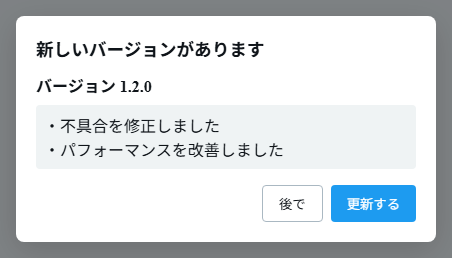
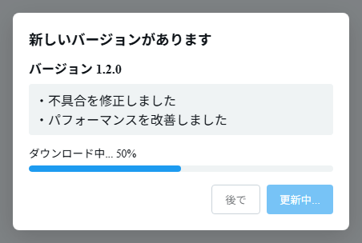

# アプリの更新

新しいバージョンの確認と適用は、アプリ内で行えます。

- **起動時の自動チェック** — アプリ起動時に新バージョンの有無を確認します。
- **手動チェック** — アプリ設定（`Ctrl+,`）→「一般」→「アプリ情報」の **「更新を確認」** ボタンからいつでも確認できます。

新しいバージョンがある場合は **「新しいバージョンがあります」** ダイアログが表示されます。

_新しいバージョン番号と更新内容が表示され、「更新する」または「後で」を選べます。_

_「更新する」を押すとダウンロードの進捗が表示されます。_

- **更新する** — 更新をダウンロードして適用します。
  - デスクトップ … ダウンロード後にインストールし、アプリが再起動します。
  - Android … 最新の APK をダウンロードし、インストーラーが起動します。画面の指示に従ってインストールしてください。
- **後で** — 今回は更新しません。キャンセルしたバージョンは再通知されず、次の新バージョンが出たとき、または手動で「更新を確認」したときに再び案内されます。

> Windows では更新後の起動時に SmartScreen の警告が出ることがあります。[インストール](./install) と同じ手順で続行できます。
